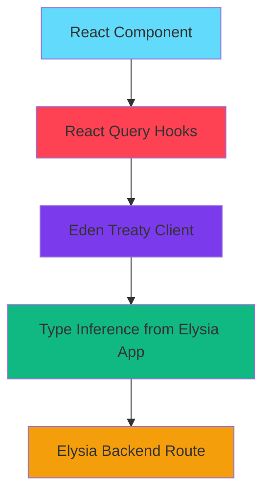

**User:**

<task>
Now from the codebase I an using the elysia js for the backend in the next.js and react query in the frontend now can you tell me how I add the eden types in the react query....
</task>
<environment_details>
# VSCode Visible Files
apps\web\src\providers\Provider.tsx

# VSCode Open Tabs

apps/web/src/providers/Provider.tsx

# Current Time

Current time in ISO 8601 UTC format: 2026-05-15T18:43:39.790Z
User time zone: Asia/Calcutta, UTC+5:30

# Current Cost

$0.00

# Review Exclusions

The following file patterns are excluded from code reviews:

- .vscode/\*\*

# Current Mode

<slug>ask</slug>
<name>❓ Ask</name>

# Current Workspace Directory (e:/DATA-REC/Code/Web Development/project/Full stack/imagr) Files

.gitignore
.npmrc
bun.lock
oxfmt.config.ts
package.json
README.md
turbo.json
vitest.config.ts
.husky/
apps/
apps/web/
apps/web/.gitignore
apps/web/AGENTS.md
apps/web/CLAUDE.md
apps/web/eslint.config.mjs
apps/web/next.config.ts
apps/web/package.json
apps/web/README.md
apps/web/tsconfig.json
apps/web/public/
apps/web/public/file.svg
apps/web/public/globe.svg
apps/web/public/next.svg
apps/web/public/vercel.svg
apps/web/public/window.svg
apps/web/src/
apps/web/src/app/
apps/web/src/app/favicon.ico
apps/web/src/app/layout.tsx
apps/web/src/app/page.tsx
apps/web/src/app/(auth)/
apps/web/src/app/(auth)/sign-in/
apps/web/src/app/(auth)/sign-in/page.tsx
apps/web/src/app/(auth)/sign-up/
apps/web/src/app/(auth)/sign-up/page.tsx
apps/web/src/app/api/
apps/web/src/app/api/[[...slugs]]/
apps/web/src/app/api/[[...slugs]]/route.ts
apps/web/src/lib/
apps/web/src/lib/eden.ts
apps/web/src/providers/
apps/web/src/providers/Provider.tsx
Imagr APIs/
Imagr APIs/.gitignore
Imagr APIs/bruno.json
Imagr APIs/Elysia Integration test copy.bru
Imagr APIs/Elysia Integration test.bru
packages/
packages/eslint-config/
packages/eslint-config/base.js
packages/eslint-config/next.js
packages/eslint-config/package.json
packages/eslint-config/react-internal.js
packages/eslint-config/README.md
packages/typescript-config/
packages/typescript-config/base.json
packages/typescript-config/nextjs.json
packages/typescript-config/package.json
packages/typescript-config/react-library.json
packages/ui/
packages/ui/components.json
packages/ui/eslint.config.mjs
packages/ui/package.json
packages/ui/postcss.config.mjs
packages/ui/tsconfig.json
packages/ui/components/
packages/ui/components/ui/
packages/ui/components/ui/button.tsx
packages/ui/lib/
packages/ui/lib/utils.ts
packages/ui/src/
packages/ui/src/styles/
packages/ui/src/styles/globals.css
You have not created a todo list yet. Create one with `update_todo_list` if your task is complicated or involves multiple steps.
</environment_details>

---

**Assistant:**

I'll help you understand how to integrate Eden types with React Query in your Next.js application using Elysia.js backend. Let me first examine your current setup to provide accurate guidance.

<read_file>
<args>
<file>
<path>apps/web/src/lib/eden.ts</path>
</file>
<file>
<path>apps/web/src/providers/Provider.tsx</path>
</file>
<file>
<path>apps/web/src/app/api/[[...slugs]]/route.ts</path>
</file>
<file>
<path>package.json</path>
</file>
<file>
<path>apps/web/package.json</path>
</file>
</args>
</read_file>

---

**User:**

[read_file for 5 files] Result:
<files>
<file><path>apps/web/src/lib/eden.ts</path>
<content lines="1-8">
1 | import { treaty } from '@elysia/eden';
2 |
3 | import { app } from '@/app/api/[[...slugs]]/route';
4 |
5 | // .api to enter /api prefix
6 | export const api =
7 | // process is defined on server side and build time
8 | typeof process !== 'undefined' ? treaty(app).api : treaty<typeof app>('localhost:3001').api;
</content>
</file>
<file><path>apps/web/src/providers/Provider.tsx</path>
<content lines="1-14">
1 | "use client"
2 | import React, { PropsWithChildren, useState } from 'react'
3 | import {QueryClient, QueryClientProvider} from "@tanstack/react-query"
4 |
5 | function Provider({children}: PropsWithChildren) {
6 | const [queryClient] = useState(()=>new QueryClient())
7 | return (
8 | <QueryClientProvider client={queryClient}>
9 | {children}
10 | </QueryClientProvider>
11 | )
12 | }
13 |
14 | export default Provider
</content>
</file>
<file><path>apps/web/src/app/api/[[...slugs]]/route.ts</path>
<content lines="1-12">
1 | import { Elysia, t } from 'elysia';
2 |
3 | export const app = new Elysia({ prefix: '/api' })
4 | .get('/', 'Hello Nextjs')
5 | .post('/', ({ body }) => body, {
6 | body: t.Object({
7 | name: t.String(),
8 | }),
9 | });
10 |
11 | export const GET = app.fetch;
12 | export const POST = app.fetch;
</content>
</file>
<file><path>package.json</path>
<content lines="1-33">
1 | {
2 | "name": "imagr",
3 | "private": true,
4 | "workspaces": [
5 | "apps/*",
6 | "packages/*"
7 | ],
8 | "scripts": {
9 | "build": "turbo run build",
10 | "dev": "turbo run dev",
11 | "lint": "oxlint .",
12 | "lint:fix": "oxlint --fix .",
13 | "format": "oxfmt --check",
14 | "format:fix": "oxfmt .",
15 | "check-types": "turbo run check-types",
16 | "prepare": "husky"
17 | },
18 | "dependencies": {
19 | "vitest": "^4.1.6"
20 | },
21 | "devDependencies": {
22 | "husky": "^9.1.7",
23 | "oxfmt": "^0.49.0",
24 | "oxlint": "^1.64.0",
25 | "prettier": "^3.7.4",
26 | "turbo": "^2.9.12",
27 | "typescript": "5.9.2"
28 | },
29 | "engines": {
30 | "node": ">=18"
31 | },
32 | "packageManager": "bun@1.3.9"
33 | }
</content>
</file>
<file><path>apps/web/package.json</path>
<content lines="1-42">
1 | {
2 | "name": "web",
3 | "version": "0.1.0",
4 | "private": true,
5 | "scripts": {
6 | "dev": "next dev -p 3001",
7 | "build": "next build",
8 | "start": "next start",
9 | "lint": "eslint",
10 | "test": "vitest run",
11 | "test:watch": "vitest --watch"
12 | },
13 | "dependencies": {
14 | "@elysia/eden": "^1.4.10",
15 | "@tanstack/react-query": "^5.100.10",
16 | "elysia": "^1.4.28",
17 | "next": "16.2.6",
18 | "react": "19.2.4",
19 | "react-dom": "19.2.4",
20 | "vitest": "^4.1.6"
21 | },
22 | "devDependencies": {
23 | "@repo/ui": "\*",
24 | "@tailwindcss/postcss": "^4",
25 | "@types/node": "^20",
26 | "@types/react": "^19",
27 | "@types/react-dom": "^19",
28 | "babel-plugin-react-compiler": "1.0.0",
29 | "eslint": "^9",
30 | "eslint-config-next": "16.2.6",
31 | "tailwindcss": "^4",
32 | "typescript": "^5"
33 | },
34 | "ignoreScripts": [
35 | "sharp",
36 | "unrs-resolver"
37 | ],
38 | "trustedDependencies": [
39 | "sharp",
40 | "unrs-resolver"
41 | ]
42 | }
</content>
</file>
</files>
<environment_details>

# VSCode Visible Files

apps\web\src\providers\Provider.tsx

# VSCode Open Tabs

apps/web/src/providers/Provider.tsx

# Current Time

Current time in ISO 8601 UTC format: 2026-05-15T18:44:00.420Z
User time zone: Asia/Calcutta, UTC+5:30

# Current Cost

$0.03

# Review Exclusions

The following file patterns are excluded from code reviews:

- .vscode/\*\*

# Current Mode

<slug>ask</slug>
<name>❓ Ask</name>
You have not created a todo list yet. Create one with `update_todo_list` if your task is complicated or involves multiple steps.
</environment_details>

---

**Assistant:**

Perfect! I can see your setup. Now let me explain how to integrate Eden types with React Query in your Elysia.js + Next.js application.

## Integration Strategy

You have two main approaches to use Eden with React Query:

### **Approach 1: Direct Eden Treaty Calls (Recommended)**

Eden Treaty already provides type-safe API calls, so you can use it directly within React Query hooks:

```typescript
// Example usage in a component
import { useQuery, useMutation } from '@tanstack/react-query';
import { api } from '@/lib/eden';

// GET request with useQuery
function MyComponent() {
  const { data, isLoading } = useQuery({
    queryKey: ['hello'],
    queryFn: async () => {
      const { data } = await api.get();
      return data;
    },
  });

  // POST request with useMutation
  const mutation = useMutation({
    mutationFn: async (name: string) => {
      const { data } = await api.post({ name });
      return data;
    },
  });

  return (
    <div>
      {isLoading ? 'Loading...' : data}
      <button onClick={() => mutation.mutate('John')}>
        Submit
      </button>
    </div>
  );
}
```

### **Approach 2: Create Type-Safe Hooks Wrapper**

Create reusable hooks that combine Eden with React Query:

```typescript
// apps/web/src/lib/api-hooks.ts
import {
  useQuery,
  useMutation,
  type UseQueryOptions,
  type UseMutationOptions,
} from '@tanstack/react-query';
import { api } from './eden';
import type { app } from '@/app/api/[[...slugs]]/route';

// Type helper to extract response types from Eden
type ApiResponse<T> = T extends Promise<infer R> ? R : never;

// GET hook
export function useApiGet(options?: Omit<UseQueryOptions<string>, 'queryKey' | 'queryFn'>) {
  return useQuery({
    queryKey: ['api', 'get'],
    queryFn: async () => {
      const { data } = await api.get();
      return data;
    },
    ...options,
  });
}

// POST hook
export function useApiPost(
  options?: Omit<UseMutationOptions<unknown, Error, { name: string }>, 'mutationFn'>,
) {
  return useMutation({
    mutationFn: async (body: { name: string }) => {
      const { data } = await api.post(body);
      return data;
    },
    ...options,
  });
}
```

### **Approach 3: Generic Hook Factory (Advanced)**

For a more scalable solution with multiple endpoints:

```typescript
// apps/web/src/lib/api-client.ts
import { treaty } from '@elysia/eden';
import type { app } from '@/app/api/[[...slugs]]/route';

export type App = typeof app;

// Create typed client
export const createApiClient = () => {
  return typeof process !== 'undefined' ? treaty<App>(app).api : treaty<App>('localhost:3001').api;
};

export const apiClient = createApiClient();
```

```typescript
// apps/web/src/hooks/use-api.ts
import {
  useQuery,
  useMutation,
  type UseQueryOptions,
  type UseMutationOptions,
} from '@tanstack/react-query';
import { apiClient } from '@/lib/api-client';

// Generic query hook
export function useApiQuery<TData = unknown>(
  queryKey: string[],
  queryFn: () => Promise<TData>,
  options?: Omit<UseQueryOptions<TData>, 'queryKey' | 'queryFn'>,
) {
  return useQuery({
    queryKey,
    queryFn,
    ...options,
  });
}

// Generic mutation hook
export function useApiMutation<TData = unknown, TVariables = unknown>(
  mutationFn: (variables: TVariables) => Promise<TData>,
  options?: Omit<UseMutationOptions<TData, Error, TVariables>, 'mutationFn'>,
) {
  return useMutation({
    mutationFn,
    ...options,
  });
}
```

## Architecture Diagram



## Key Benefits

1. **Full Type Safety**: Eden Treaty provides end-to-end type safety from backend to frontend
2. **Automatic Type Inference**: TypeScript infers request/response types from your Elysia routes
3. **React Query Features**: Get caching, refetching, optimistic updates, etc.
4. **No Code Generation**: Unlike tRPC, Eden works without build-time code generation

## Example: Complete Implementation

Here's a practical example with your current setup:

```typescript
// apps/web/src/app/example/page.tsx
'use client';

import { useQuery, useMutation, useQueryClient } from '@tanstack/react-query';
import { api } from '@/lib/eden';

export default function ExamplePage() {
  const queryClient = useQueryClient();

  // GET request
  const { data: greeting, isLoading } = useQuery({
    queryKey: ['greeting'],
    queryFn: async () => {
      const response = await api.get();
      return response.data; // Fully typed!
    },
  });

  // POST request
  const createMutation = useMutation({
    mutationFn: async (name: string) => {
      const response = await api.post({ name }); // Type-safe body
      return response.data;
    },
    onSuccess: () => {
      // Invalidate and refetch
      queryClient.invalidateQueries({ queryKey: ['greeting'] });
    },
  });

  return (
    <div>
      <h1>{isLoading ? 'Loading...' : greeting}</h1>
      <button onClick={() => createMutation.mutate('Alice')}>
        Create
      </button>
    </div>
  );
}
```

## Best Practices

1. **Organize query keys**: Use consistent naming conventions
2. **Error handling**: Eden returns `{ data, error }` - handle both cases
3. **Optimistic updates**: Use React Query's optimistic update features
4. **Prefetching**: Leverage React Query's prefetching for better UX

The beauty of this setup is that your [`eden.ts`](apps/web/src/lib/eden.ts:1) already provides the typed client, and you just need to wrap it with React Query hooks for state management!

---

**User:**

[ERROR] You did not use a tool in your previous response! Please retry with a tool use.

# Reminder: Instructions for Tool Use

Tool uses are formatted using XML-style tags. The tool name itself becomes the XML tag name. Each parameter is enclosed within its own set of tags. Here's the structure:

<actual_tool_name>
<parameter1_name>value1</parameter1_name>
<parameter2_name>value2</parameter2_name>
...
</actual_tool_name>

For example, to use the attempt_completion tool:

<attempt_completion>
<result>
I have completed the task...
</result>
</attempt_completion>

Always use the actual tool name as the XML tag name for proper parsing and execution.

# Next Steps

If you have completed the user's task, use the attempt_completion tool.
If you require additional information from the user, use the ask_followup_question tool.
Otherwise, if you have not completed the task and do not need additional information, then proceed with the next step of the task.
(This is an automated message, so do not respond to it conversationally.)
<environment_details>

# VSCode Visible Files

apps\web\src\providers\Provider.tsx

# VSCode Open Tabs

apps/web/src/providers/Provider.tsx

# Current Time

Current time in ISO 8601 UTC format: 2026-05-15T18:44:25.393Z
User time zone: Asia/Calcutta, UTC+5:30

# Current Cost

$0.06

# Review Exclusions

The following file patterns are excluded from code reviews:

- .vscode/\*\*

# Current Mode

<slug>ask</slug>
<name>❓ Ask</name>
You have not created a todo list yet. Create one with `update_todo_list` if your task is complicated or involves multiple steps.
</environment_details>

---

**Assistant:**

<attempt_completion>
<result>
I've analyzed your codebase and here's how to integrate Eden types with React Query in your Elysia.js + Next.js setup:

## Integration Approaches

**Approach 1: Direct Eden Treaty with React Query (Recommended)**

Use your existing [`eden.ts`](apps/web/src/lib/eden.ts:1) client directly in React Query hooks:

```typescript
import { useQuery, useMutation } from '@tanstack/react-query';
import { api } from '@/lib/eden';

// GET with full type safety
const { data } = useQuery({
  queryKey: ['hello'],
  queryFn: async () => {
    const { data } = await api.get();
    return data;
  },
});

// POST with typed body
const mutation = useMutation({
  mutationFn: async (name: string) => {
    const { data } = await api.post({ name });
    return data;
  },
});
```

**Approach 2: Create Reusable Type-Safe Hooks**

```typescript
// apps/web/src/lib/api-hooks.ts
import { useQuery, useMutation } from '@tanstack/react-query';
import { api } from './eden';

export function useApiGet() {
  return useQuery({
    queryKey: ['api', 'get'],
    queryFn: async () => {
      const { data } = await api.get();
      return data;
    },
  });
}

export function useApiPost() {
  return useMutation({
    mutationFn: async (body: { name: string }) => {
      const { data } = await api.post(body);
      return data;
    },
  });
}
```

## Key Points

- Eden Treaty automatically infers types from your [`route.ts`](apps/web/src/app/api/[[...slugs]]/route.ts:1) Elysia app
- No code generation needed - types flow from backend to frontend
- React Query handles caching, refetching, and state management
- Eden returns `{ data, error }` - handle both in your components
- Your [`Provider.tsx`](apps/web/src/providers/Provider.tsx:1) already wraps the app with QueryClientProvider

The beauty of this setup is that TypeScript automatically infers all request/response types from your Elysia routes through Eden Treaty!
</result>
</attempt_completion>
